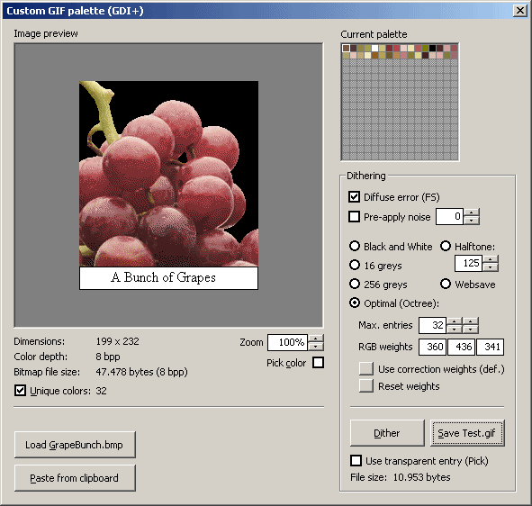



## Save custom palette GIFs \(GDI\+\)

### Description

Save custom palette GIFs using GDI+. This is a basic application, nevertheless you can easily extend it. 

----

Zip 92Kb (Screenshot done using this code) 

----

Last update: 2003.03.13
 
### More Info
 

             |
---                |---
**Submitted On**   |2003-03-13 13:23:14
**By**             |[Carles P\.V\.](https://github.com/Planet-Source-Code/PSCIndex/blob/master/ByAuthor/carles-p-v.md)
**Level**          |Intermediate
**User Rating**    |5.0 (85 globes from 17 users)
**Compatibility**  |VB 6\.0
**Category**       |[Graphics](https://github.com/Planet-Source-Code/PSCIndex/blob/master/ByCategory/graphics__1-46.md)
**World**          |[Visual Basic](https://github.com/Planet-Source-Code/PSCIndex/blob/master/ByWorld/visual-basic.md)
**Archive File**   |[Save\_custo1763076282004\.zip](https://github.com/Planet-Source-Code/carles-p-v-save-custom-palette-gifs-gdi__1-43599/archive/master.zip)

